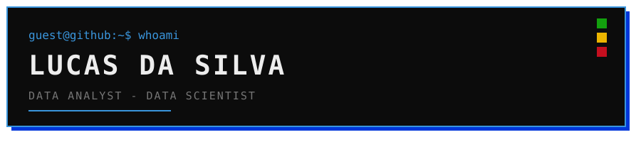

### `$ whoami`

Analista/Cientista de dados. Atualmente interessado em políticas públicas baseadas em evidências, urbanismo, educação e aprendizado, finanças e ciência na fronteira do conhecimento.

### `$ ls ./tech-stack`

### `$ cat contact.txt`

